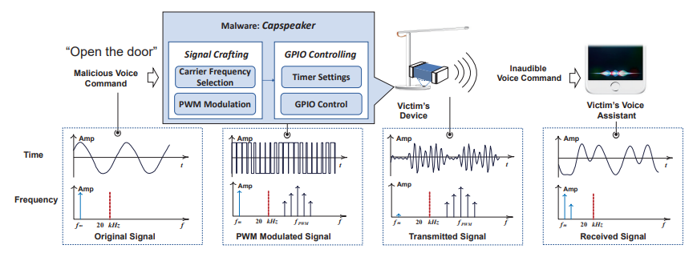
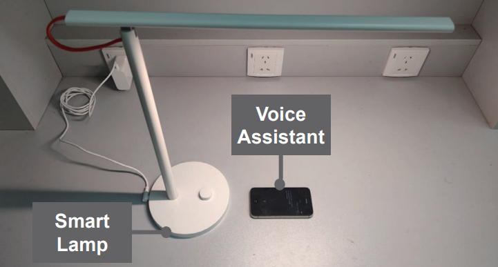

# What is CapSpeaker?
Capacitors are ubiquitous and indispensable components in electronic devices since they are used for voltage stabilization, filtering, etc. Particularly, Multi-layer Ceramic (MLC) capacitors are dominant due to their high energy density and low cost. we investigate the feasibility of utilizing commodity electronic devices with built-in capacitors to inject malicious voice commands into voice assistants, such as Apple Siri, Xiaomi Art Speaker. Unlike existing work that injects malicious voice commands into voice assistants via a loudspeaker, we propose CapSpeaker that can inject voice commands by converting an electronic device (e.g., a lamp) that are not designed to produce voice into a speaker. 

# System Workflow of CapSpeaker
<p align="center" width="100%">
    
</p>
CapSpeaker first selects an appropriate carrier frequency, and then PWM-modulates the baseband signal with voice commands onto the carrier. Then, CapSpeaker manipulates the GPIO pin using high-level programming instructions to generate the PWM-modulated signal, which drives the capacitors to produce the desired inaudible voice commands. Finally, the produced voice commands can be received and demodulated by the victim’s voice assistant, which executes the command.

# How Does CapSpeaker Work?
* **How can a capacitor produce voices?** An MLC capacitor is a fixed-value capacitor using ceramic material as dielectric. The ceramics have the inverse piezoelectric characteristics, i.e., applied electric fields can induce mechanical strain force. The frequency of the sounds depends on the frequency of the voltage signal applied on the capacitor and its strength is determined by the peak-to-peak amplitude of the voltage, the piezoelectric constant p, and the printed circuit board (PCB) layout, etc. To inject human voices by CapSpeaker despite the low frequency response below 4 kHz, we modulate the malicious voice commands on a carrier of a high-frequency band, e.g., ≥ 20 kHz, where the capacitors have the peak frequency response and produce a loud voice. The benefit of such a solution is that CapSpeaker can produce inaudible voice commands, similar to [DolphinAttack](https://github.com/USSLab/DolphinAttack).
* **How to control the sound of a capacitor?** Particularly, CapSpeaker consists of two modules: a signal crafting module and a GPIO controlling module, whereby the signal crafting module creates an intermediate signal that contains the malicious voice command yet can drive the GPIO controlling module to induce the capacitors to produce a sound with the chosen voice command. The signal crafting code can be seen in [generate_capspeaker_duty_traces.m](./generate_capspeaker_duty_traces.m), where the input is the attack audio from [voice_command](./voice_command) and the output is a duty cycle trace array to be used for GPIO controlling, examples can be found at [traces](./traces). The GPIO controlling program for ESP-WROOM-32D is in [GPIOctrl.c](./GPIOctrl.c), where it takes in the trace (relocated to [dutyArray.h](./dutyArray.h)) and control the duty cycle accordingly.
  * **Signal crafting module:** The signal crafting module addresses two issues: 1) Selecting a proper carrier frequency for modulation to make the attack signal inaudible yet match the frequency response of the capacitors. 2) Utilizing a feasible modulation scheme to modulate the voice command onto the selected carrier frequency, considering the limitation of device hardware and software.
    * **Carrier frequency:** 1) In order to achieve the best **frequency response of the MLC capacitor**, the choice of a carrier frequency should be above 20 kHz and below 80 kHz, according to our experimentation. 2) To fully exploit the **nonlinearity** of the victim voice assistant's microphone, we consider the frequency bands of [2 kHz,20 kHz], or [27 kHz,38 kHz]. 3) To make our attack **inaudible**, the carrier frequency should be above 20 kHz.
    * **PWM-based modulation:** Normally, IoT devices are unable to output signals of fine-grained amplitudes. Instead, GPIO can only output two levels, i.e., a “low” level or a “high” level, which are often 0 V and 5 V for commercial smart devices. Therefore, we resort to the pulse-width modulation (PWM) scheme which only needs two levels of output voltage.
  * **GPIO controlling module:** To run the malware of CapSpeaker on the victim device, we exploit the off-the-shelf hardware PWM API on MCUs, which is usually implemented and controlled by a timer. Suppose the period of the PWM waveform is T, and the duty cycle is D. Then the PWM waveform with parameters T, D is achieved by setting the GPIO output to 1 during the active state and vice versa. The MCU in our setup is ESP-WROOM-32D, which cannot support real-time fine-grained (i.e., 32 kHz) PWM calculation. Therefore, to strike the balance between accuracy and implementation, we increase the duty cycle to every two PWM periods to decrease the calculation overhead. Suppose that the duty cycle trace of the malicious voice command is Duty\[0\], Duty\[1\], Duty\[2\], ..., we select Duty\[0\], Duty\[2\], Duty\[4\], ... to set the PWM duty value.

# Demo Videos
The full demo videos can be found at [CapSpeaker Demo Link](https://sites.google.com/view/capspeaker).
* **CapSpeaker Demo on A Commercial Lamp**  
<p align="center" width="100%">
    
</p>

# Evaluation of CapSpeaker
We utilized a self-implemented LED lamp and a commercial one to validate the performance of CapSpeaker. 

* **Dataset** 

[Open the door](https://github.com/USSLab/CapSpeaker/blob/main/voice_command/open-the-door-George.mp3)

[Open the door (Chinese)](https://github.com/USSLab/CapSpeaker/blob/main/voice_command/open-the-door-chinese.aac)

[Call my wife](https://github.com/USSLab/CapSpeaker/blob/main/voice_command/call-my-wife-George.mp3)

[Call my wife (Chinese)](https://github.com/USSLab/CapSpeaker/blob/main/voice_command/call-my-wife-chinese-2s.wav)

[Turn on airplane mode](https://github.com/USSLab/CapSpeaker/blob/main/voice_command/turn-on-airplane-mode-John.mp3)

[Turn on airplane mode (Chinese)](https://github.com/USSLab/CapSpeaker/blob/main/voice_command/turn-on-airplane-mode-chinese.aac)

* **Performance on self-designed lamp:** We implemented a prototype of CapSpeaker using a group of LEDs, an LED driver, and an MCU board. We used 11 LEDs in series, and each LED is of 3W power.
<p align="center" width="100%">
    
</p>
Performance of CapSpeaker on self-designed lamp can be seen as follows.

Type      |Manuf. | Model      |Rel. Date| OS/Version |Voice Assistant|Recog.|Carrier Freq. (kHz)|Max. Dist. (cm)
----------|-------|------------|---------|------------|---------------|------|-----------|---------------
Smartphone|Apple  | iPhone 4s  | 2011.10 | iOS 9.3.5  | Siri          |Y     | 32        |10.5
Smartphone|Huawei | Nova 5i Pro| 2019.07 | EMUI 10.1.0| Xiaoyi        |Y     | 33        |9
Tablet    |Apple  | iPad mini 5| 2019.03 | iOS 13.5.1 | Siri          |Y     | 24        |3.5
Smartphone|Redmi  | K30 Ultra  | 2020.08 |MIUI 12.0.18| iFlytek       |Y     | 28        |0.5
Smartphone|Apple  | iWatch S1  | 2015.04 | watchOS 3.1| Siri          |Y     | 22.3      |0.2


* **Performance on commercial lamp:** In addition to the self-implemented LED prototype, we validated the feasibility of CapSpeaker against a commercial LED lamp. The
commercial product is a Xiaomi 1S Lamp. To ease the burden of reverse engineering the firmware, we directly replace its MCU board with one of the same models (ESP-WROOM-32D), and implant the malware inside the new MCU board in advance.
<p align="center" width="100%">
    
</p>
Performance of CapSpeaker on commercial lamp can be seen as follows.

Type      |Manuf. | Model      |Rel. Date| OS/Version |Voice Assistant|Recog.|Carrier Freq. (kHz)|Max. Dist. (cm)
----------|-------|------------|---------|------------|---------------|------|-----------|---------------
Smartphone|Apple  | iPhone 4s  | 2011.10 | iOS 9.3.5  | Siri          |Y     | 32        |3.2
Smartphone|Huawei | Nova 5i Pro| 2019.07 | EMUI 10.1.0| Xiaoyi        |Y     | 33        |2.9
Tablet    |Apple  | iPad mini 5| 2019.03 | iOS 13.5.1 | Siri          |Y     | 24        |0.5

# Contact
* Prof. Wenyuan Xu (<wyxu@zju.edu.cn>)
* Prof. Xiaoyu Ji (<xji@zju.edu.cn>)
* Mr. Juchuan Zhang(<juchuanzhang@zju.edu.cn>)
# Citation

```
@inproceedings{CapSpeaker_CCS21,
  author    = {Xiaoyu Ji and
               Juchuan Zhang and
               Shui Jiang and
               Jishen Li and
               Wenyuan Xu},
  title     = {{CapSpeaker}: Injecting Voices to Microphones via Capacitors},
  booktitle = {Proceedings of the 2021 {ACM} {SIGSAC} Conference on Computer and Communications Security {(CCS '21)},  November 15–19, 2021, Virtual Event, Republic of Korea},
  doi       = {10.1145/3460120.3485389}
}
```

# Powered by

<table bgcolor="white">
<tr valign="middle">
<td width="50%" align="center" colspan="2">
 <a href="http://usslab.org">Ubiquitous System Security Laboratory (USSLab) 
</td>
<td width="50%" align="center" colspan="2">
  <a href="http://www.zju.edu.cn/english">Zhejiang University 
</td>
</tr>
<tr valign="middle">
<td width="50%" align="center" colspan="2">
  <a href="http://usslab.org"></a>
  <a href="http://usslab.org"></a>
</td>
<td width="50%" align="center" colspan="2">
  <a href="http://www.zju.edu.cn/english/"></a>
  <a href="http://www.zju.edu.cn/english/"></a>
</td>
</tr>
</table>
